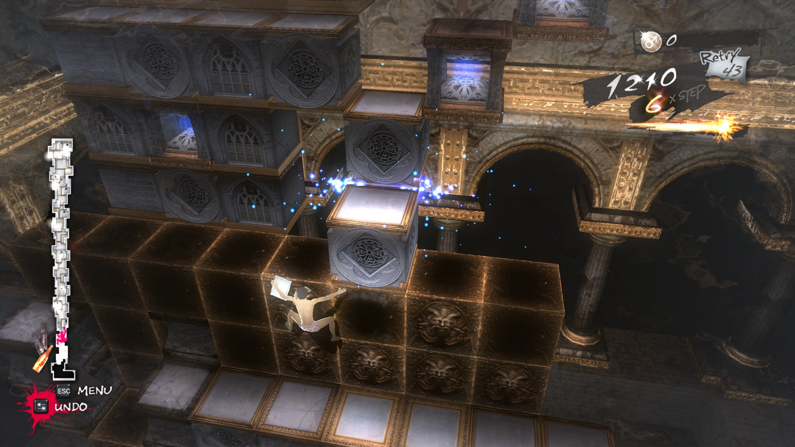

# Hearthstone Battlegrounds 
## Clarity

- **Artistic clarity**
	- Intense artistic emphasis on finding a triple communicates its gameplay importance. The specific instances of this emphasis are:
		- An up-arrow overlapping a creature in Bob's tavern, which indicates an available triple. An arrow is big and moving in its own rhythm, which makes it stand out even during fast paced series of tavern refreshes
		- The Bob saying "Looks like you can get a triple"
		- A visually striking animation of creatures merging in a triple
- **Design clarity** 
	- A unique special abilities of each hero are taking advantage of existing battlegrounds mechanics, and by doing so the game prompts to a player an idea of their possible winning strategies.
- **Technical clarity**
	- The modular gameplay, provided by a game phases, facilitates an implementation of a new depth-adding game features. Designers can take an already existing game's mechanics and put them in uncustomary game phases, thereby possibly adding a new dynamics in a game. One of the examples of the feature made in a such way is a *Start of combat* keyword.

## One the Most Clear Thing
- All actions available to the player are clear from the first glance, thanks for
	- big action buttons with descriptive icons and short follow-up texts emphasising only what is important
	-  green and blue glowing edges of elements giving a clue on what else player could do 

## Possible Improvements
- The heroes like Cariel, Kurtus, Azshara, Ragnaros has a progression of ability mechanic. But it's not clear from ability descriptions of these heroes how exactly ability progresses.

# The Banner Saga

- **Artistic clarity**
	- When an enemy is in a simple attack range from active hero, the game puts a red token on this enemy. The range is calculated from current hero's position or from one of the new possible positions, which player may consider before committing their move action. A number inside the token indicates a strength damage the hero will cause by their simple attack to this enemy.
	  This feature provides a player with a clarity on their current and possible status, and empowers a strategic dynamic of the game.
- **Design clarity**
	- In the beginning of a player's turn the game automatically puts the player in a movement stage, suggesting them to start their turn with movement.  If the player has made a move action, *the action wheel* pops up immediately near an active hero, and the player sees the rest of available actions.
	  This design decision is good for 2 reasons:
	  1. *It introduces a new players to the battle system's core loop*: choose position => make an action => repeat 
	  2. *It breaks player's decision process in a smaller pieces*, which prevents the player from analysis paralysis 
- **Technical clarity**
	- An outcomes of battle mechanics are unambiguous. All combatants are basically chess pieces with defined movement patterns and there is almost no chance involved in a damage calculation. My guess is that such predictability allows to build a more controlled AI behaviour, and it was easier for designers to orchestrate dramatic moments of player's tension and relaxation in battle gameplay. 

## One the Most Clear Thing 
- "Renown" is a very valuable resource in the game
	- When you kill an enemy, the big red banner indicates that you gain +x renown 
	- Heroes are promoted for renown points
	- Renown is the currency for buying almost any other resources in the game

## Possible Improvements
- To emphasise the STR-health-attack correlation. 
   It's the most basic and important rule of the game, that health and attack are both depended on STR stat, and when character losses its health it becomes weaker. 
   Although this rule is communicated through a text in the first tutorial battle, it would be nice to have a constant visual indication of this rule throughout the game. This way it would be easier to the player to get comfortable with this unique rule.
- Some dialog options are easy to misinterpret; the dialogue choices outcomes are not clear.
- Rook's "Mark Prey" ability could show allies, who has a chosen target in range. 

# Pillars of Eternity II: Deadfire

- **Artistic clarity**
	-  Spell icons. Despite the small size of icons, they are very detailed and are clear at the same time. Each spell icon conveys a recognisable story, making it easy to guess an outcome of its casting.
	- Attack range, AOE radiuses, engagement and flanking statuses are easy to see with contrast lines/arrows/surfaces. 
	-  Beautiful artworks motivates a player to explore and interact with the game world
- **Design clarity** 
	- Consistency in the keywords helps a player to see and study the system behind the combats and other game challenges 
	- A unity of game's mechanics, combat system and narrative helps the player to make an educated guesses, when building their characters. 
	  The player might not know all combat system details, but they can still build their character based on their *feel* of what the wizard, priest, paladin, etc is. And this based-on-feel character most likely will be playable, because the game is designed to meet the expectations of the player.    
-  **Technical clarity**
	- The D&D-like magic spell-slots system allowed to use an elegant UI decision of grouping spells in a folder-like structure.
	- The ship management interface inherits from a character inventory interface. It provides a clarity for a player on learning a new game feature, and allows developers to reuse their old work.

## One the Most Clear Thing 
- An exploration and progression are the main sources of fun in the game. Some features communicating this idea are:
	- *Progression* 
		- Classes, subclasses and skills tree
		- Companions exclusive subclasses and abilities 
		- Fractions and companions relationship tree interface and logs
	- *Exploration*
		- The clean, well distributed and almost minimalistic UI takes as little player's attention from the game world as it can
		-  The maps are used for traveling between big game locations (camps, cities, islands)
		- The level elements (architecture, NPC, interactive objects) are positioned and presented to a player in a curiosity awakening ways
		- Lots of spells and statuses, which require player's conscious study to utilize them in the best possible way and find their ways around some challenging enemies

## Possible improvements 
- The information about the game's stats and status effects is scattered in spells and items description and character window. Although its a good de-emphasising tactic to protect the player from analysis paralysis, it wouldn't hurt to has all this knowledge written and clearly presented in one place in a systemised way. Like a TTRPG system rulebook, but for video game.
- Action status icons above a characters, like: "idle", "attacking", "casting a spell" are poorly emphasised. They are undistinguishable color-wise and their transaction is not catching player's attention. 
   It's too easy to give one of your characters a command, shift your attention, while they making an action, and never get back to give another command. Such dynamic leads to a truly frustrating game experience when during a battle you realise, that one of your characters just did noting for like 30 seconds.
- There are bugs in the games. The game was harshly bugged on its release day, had lots of bug-fixing patches after release and even now players reports on some big game breaking bugs.

# Catherine

* ***Artistic clarity**
	* "*EDGE!*". The game provides the most intense feedback on the most important game mechanic - edge connection. Each time edges are connected the player sees an exploding blue edge glow and the female narrators voice saying "Edge!". 
	  A clarity in this aspect is one of the main reasons why this time restricted, puzzle solving game feels so smooth and addictive, despite its frustrating difficulty.
	* A map of the level on the left side of the Nightmare screen provides a player an information on their progress
* ***Design clarity**
	*  The ladder-like level structure clearly communicates the level's goal: *reach the top of the ladder*; and states a short term goal: *find a way to  climb the next step*. 
	* The game is not shy to communicate the player's goals status and threats through a text, because the text in a game is delivered to a player in an engaging ways:
		* narrated tutorial pieces
		* narrated UI interactions
		* voiced cut-scene dialogues 
		* interactive text messages on a phone  
	* The Mysterious Meter gives an immediate feedback on player's moral decision
	* The game's camera changes its position to clearly show an impact of bosses abilities
- **Technical clarity**
	- The ladder puzzle game idea is so elegant, that, despite being implemented as a real-time action game, it could be easily described in discrete terms of turn based game. Such atomicity has a huge value when it comes to prototyping and system formalization of the game.
## One the Most Clear Thing 
- The importance of "EDGE!" mechanics 

## Possible Improvements
- Not found yet