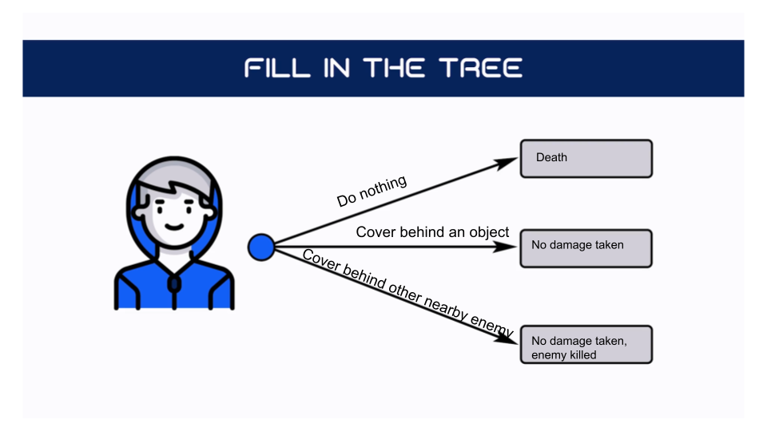
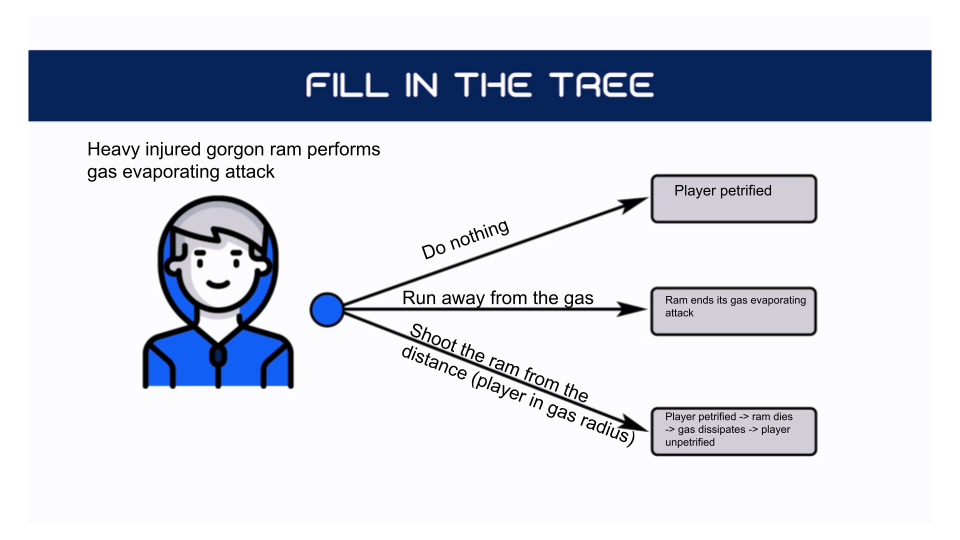

# Response Analysis
## Analyzing existing games  
Response | Game | Situation | Tools | Outcomes | Decision tree
--- | --- | --- | --- | --- | ---
**inactive emotional** | Psychonauts 2 | An interns teaming up with Ratz to complete the mission in casino | A player's attitude toward other interns | The game evokes in a player emotions of fun, surprise and gratitude | nan 
**proactive twitch** | Transistor | Player applied *functions* and movement in *Turn()* mode | *Functions*, *Turn()* | The game responses with a fast series of action animations and executions, which player thoughtfully directed a moment ago | nan
**reactive twitch** | The Witcher 3 | An enemy telegraphs its attack with animation | Parry, roll, dodge, traps, signs, ranged weapons | Player has a window of opportunity to utilize one of many combat tools they have and change the outcome of enemies attack | [link](https://github.com/Treppe/game-design-journal/blob/master/Decision%20Trees/DTree%20-%20The%20Witcher%203(1)(5).png)  
**proactive choice** | Skyrim | Round Door Puzzle | Previously found dragon claw | Player must put circle locks on a door in rights combination (make a series of choices) to pass through the door | [link](https://github.com/Treppe/game-design-journal/blob/master/Decision%20Trees/DTree%20-%20Skyrim(2)(1).png) 
**reactive  choice** | Middle-earth: Shadow of Mordor | The uruc's captain you are hunting is ambushed by another captain of the lower tier | The Nemesis system | Any decision player makes about resolving this situation will affect a power structure in uruc's army. The player is the one to choose how exactly it will change | [link](https://github.com/Treppe/game-design-journal/blob/master/Decision%20Trees/DTree%20-%20Middlearth.drawio(4).png) 
**proactive strategy** | Dying Light  | The change of day and night | Safe Zones, UV flashlights | If player is not ready for threats of the night they should strategize their travel around the idea to get in Safe Zone before the night comes | [link](https://github.com/Treppe/game-design-journal/blob/master/Decision%20Trees/Dying%20Light%20-%20DTree.drawio(2)(1).png)
**reactive strategy** | Endless Legend | Global event: "Ententes and Alliances" | Alliance mechanic | When event starts player has a decision to make: build an alliance with another player and get an influence boost or ignore it and keep playing solo. Both these decision influence  the later player's strategy in a big way (see examples in decision tree) | [link](https://github.com/Treppe/game-design-journal/blob/master/Decision%20Trees/DTree%20-%20Endless%20Legend.drawio(1).png)

## Premade scenario - Sniper
**Situation**
	- an FPS, a sniper atop a mountain far away is taking shots at you
- **Warning**
	- a laser beam flickering around you for a few seconds, then becomes solid and red right before the shoot is fired
- **How can your character respond to this situation?**
  

## Create your own mechanics
1. **Consider a ram** - create an attack that it could perform at combat
   - Headbutt 
2. **Twist it** - add a modifier to the creature
   - It's a [gorgon](https://www.dndbeyond.com/monsters/16908-gorgon) ram
3. **Update** your situation 
   - The ram stands on the back hooves and bleeps. The green gas emerges from its nose. It stands back on its four and a green circle of gas slowly grows around the ram. 
   - While ram performing this gas evaporating attack it also takes a defensive stance: taken damage is reduced
   - Player reduces its speed when touched by gas. If gas touches the player for more then 2 seconds it makes player *petrified* and they can't move until take any damage or the ram dies. Any damage taken while petrified is doubled 
4. **Create the player's decision tree**
  